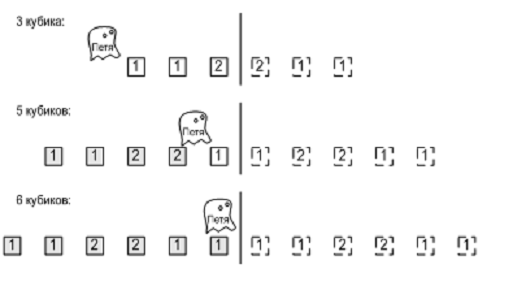

[К оглавлению](../../README.md)

## D. Кубики в зеркале

Ограничение времени	5 секунд
Ограничение памяти	256Mb
Ввод	стандартный ввод или input.txt
Вывод	стандартный вывод или output.txt
Привидение Петя любит играть со своими кубиками. Он любит выкладывать их в ряд и разглядывать свое творение. Недавно друзья решили подшутить над Петей и поставили в его игровой комнате зеркало. Известно, что привидения не отражаются в зеркале, а кубики отражаются. Теперь Петя видит перед собой N цветных кубиков, но не знает, какие из этих кубиков настоящие, а какие — отражение в зеркале. Выясните, сколько кубиков может быть у Пети. Петя видит отражение всех кубиков в зеркале и часть кубиков, которая находится перед ним. Часть кубиков может быть позади Пети, их он не видит.



Формат ввода
Первая строка входного файла содержит число N ( 1 ≤ N ≤ 1000000 ) и количество различных цветов, в которые могут быть раскрашены кубики — M ( 1 ≤ M ≤ 1000000 ). Следующая строка содержит N целых чисел от 1 до M — цвета кубиков.

Формат вывода
Выведите в выходной файл все такие K, что у Пети может быть K кубиков

```cpp
#include <algorithm>
#include <cmath>
#include <cstdlib>
#include <fstream>
#include <iostream>
#include <sstream>
#include <string>
#include <vector>
using namespace std;
int main() {
    string str1, str2;
    int x_ = 257;  // 10
    long p = pow(10, 9) + 7;
    string tmp;
    ifstream file("input.txt");
    if (file.is_open()) {
        string line;
        int n;
        getline(file, line);
        n = atoi(line.c_str());
        vector<int> res(n);
        vector<long long int> h1;
        vector<long long int> h2(n + 1);
        vector<long long int> x;
        h1.push_back(0);
        x.push_back(1);
        getline(file, line);
        int i = 0;
        istringstream iss(line);
        string token;
        while (getline(iss, token, ' ')) {
            res[i] = atoi(token.c_str());
            ++i;
        }
        for (int i = 1; i < n + 1; i++) {
            h1.push_back((h1[i - 1] * x_ + res[i - 1]) % p);
            h2[i] = ((h2[i - 1] * x_ + res[n - i]) % p);
            x.push_back((x[i - 1] * x_) % p);
        }
        int len = res.size();
        long long int target_h, c_p = 0;
        for (int i = n / 2; i > 0; --i) {
            target_h = h1[i];
            c_p = (h2[len - i] - (h2[len - (i + i)] * x[(len - i) - (len - (i + i))])) % p;
            if (c_p == target_h) {
                cout << n - i << " ";
            }
            c_p = p + (h2[len - i] - (h2[len - (i + i)] * x[(len - i) - (len - (i + i))])) % p;
            if (c_p == target_h) {
                cout << n - i << " ";
            }
        }
        cout << n << "\n";
    } else {
        cout << "Не удалось открыть файл." << endl;
    }
    file.close();
}
```