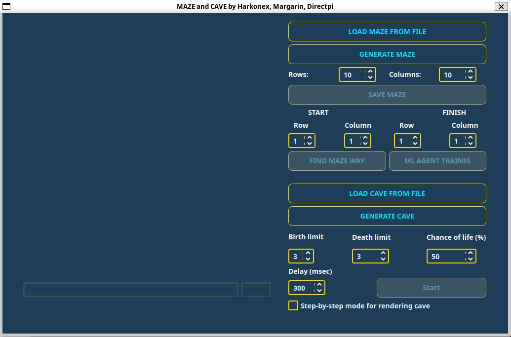

[К оглавлению](../README.md)

# MAZE and CAVE - Документация проекта

## Обзор командного проекта

**MAZE and CAVE** - это многофункциональное приложение на C++20 с графическим интерфейсом 
Qt, предназначенное для генерации, решения лабиринтов и моделирования пещер с 
использованием клеточного автомата. Проект также включает функции машинного обучения с 
подкреплением и веб-интерфейс.



## Архитектура проекта

### Структура директорий

```
A1_Maze_CPP/
├── src/
│   ├── api/                    # API слой
│   ├── common/                 # Общие утилиты и классы
│   ├── dungeon/
│   │   ├── core/              # Основная логика лабиринтов и пещер
│   │   ├── io/                # Ввод/вывод данных
│   │   └── pathfinding/       # Алгоритмы поиска пути
├── include/                    # Заголовочные файлы
├── gui/                       # GUI на Qt
├── test/                      # Unit тесты  
├── web/                       # Веб-интерфейс
├── resources/                 # Ресурсы приложения
└── files/                     # Примеры файлов
```

### Технологический стек

- **Язык программирования**: C++20
- **GUI Framework**: Qt5/Qt6
- **Система сборки**: Makefile + qmake
- **Тестирование**: Google Test
- **Веб-интерфейс**: Node.js + React/Vue (фронтенд)
- **Стиль кода**: Google Style Guide

## Основные функции

### 1. Работа с лабиринтами

#### Загрузка лабиринта
- Поддержка загрузки лабиринтов из файла через кнопку **"LOAD MAZE FROM FILE"**
- Максимальный размер: 50×50
- Автоматическое масштабирование под размер окна

#### Генерация лабиринта
- Автоматическая генерация идеальных лабиринтов по алгоритму Эллера
- Настройка размеров через поля **Rows** и **Columns** (по умолчанию 10×10)
- Кнопка **"GENERATE MAZE"** для создания нового лабиринта
- Сохранение сгенерированного лабиринта через **"SAVE MAZE"**

#### Решение лабиринта
- Настройка начальной и конечной точек через поля **START** и **FINISH**
- Кнопка **"FIND MAZE WAY"** для поиска пути
- Визуализация маршрута цветной линией
- Поддержка алгоритма поиска в ширину (BFS)

### 2. Машинное обучение

#### ML агент
- Кнопка **"ML AGENT TRAINING"** для обучения агента
- Использование Q-learning алгоритма
- Обучение агента поиску оптимального пути в лабиринте
- Возможность тестирования обученного агента

### 3. Работа с пещерами

#### Загрузка и генерация пещер
- Кнопка **"LOAD CAVE FROM FILE"** для загрузки пещеры
- **"GENERATE CAVE"** для создания новой пещеры
- Максимальный размер: 50×50

#### Параметры клеточного автомата
- **Birth limit**: предел "рождения" клетки (по умолчанию 3)
- **Death limit**: предел "смерти" клетки (по умолчанию 3)  
- **Chance of life (%)**: вероятность начальной инициализации (по умолчанию 50%)

#### Моделирование
- **Delay (msec)**: задержка между итерациями (по умолчанию 300мс)
- Чекбокс **"Step-by-step mode for rendering cave"** для пошагового режима
- Кнопка **"Start"** для запуска симуляции

## Сборка и установка

### Требования
- C++20 совместимый компилятор (g++)
- Qt5 или Qt6
- Google Test для тестирования
- Node.js и npm (для веб-интерфейса)

### Команды сборки

```bash
# Сборка основного приложения
make all

# Запуск тестов
make tests

# Генерация отчета покрытия
make gcov_report

# Установка
make install

# Удаление
make uninstall

# Очистка
make clean

# Создание архива
make dist
```

### Веб-интерфейс

```bash
# Запуск веб-версии
make web_start

# Остановка веб-серверов  
make web_stop
```

## Алгоритмы и методы

### Генерация лабиринта (Алгоритм Эллера)
- Создание идеального лабиринта без изолированных областей и петель
- Единственный путь между любыми двумя точками
- Эффективная генерация для больших размеров

### Поиск пути (BFS)
- Алгоритм поиска в ширину для нахождения кратчайшего пути
- Гарантированное нахождение оптимального решения
- Визуализация найденного маршрута

### Клеточный автомат для пещер
- Итеративное моделирование развития пещерной системы
- Настраиваемые параметры рождения и смерти клеток
- Пошаговый и автоматический режимы визуализации

### Q-learning для ML агента
- Обучение с подкреплением без готовых библиотек
- Самостоятельная реализация Q-learning алгоритма
- Обучение на фиксированном лабиринте с фиксированной целью

## Форматы файлов

### Лабиринт
```
4 4
0 0 1 0
1 0 1 1  
0 1 0 1
0 0 0 1

1 0 1 0
0 0 1 0
1 1 0 1
1 0 0 1
```

### Пещера
```
4 4
0 1 1 0
1 0 0 1
0 1 1 0
1 0 0 1
```

## Тестирование

Проект включает полное покрытие unit-тестами для всех основных модулей:
- Генерация лабиринтов
- Решение лабиринтов  
- Генерация пещер
- ML агент

Запуск тестов и генерация отчета:
```bash
make tests
make gcov_report
```

## Веб-версия

Проект включает полнофункциональную веб-версию со всеми базовыми возможностями:
- Генерация и решение лабиринтов
- Работа с пещерами
- Современный веб-интерфейс
- REST API для взаимодействия с бэкендом

## Особенности реализации

- **Соответствие Google Style Guide**
- **Модульная архитектура** с четким разделением ответственности
- **RAII и современный C++20**
- **Кроссплатформенность** благодаря Qt
- **Производительность** оптимизированных алгоритмов
- **Расширяемость** через паттерны Factory и Strategy

## Запуск приложения

```bash
# После сборки
./maze

# Или через make
make run
```

При запуске открывается главное окно с интуитивно понятным интерфейсом, где все функции доступны через соответствующие кнопки и поля ввода.

Авторы: Directpi (QT - интерфейс, 2 алгоритма задачи Коммивояжера + Benchmark), Harkonex(backend), Margarin (backend+Web)