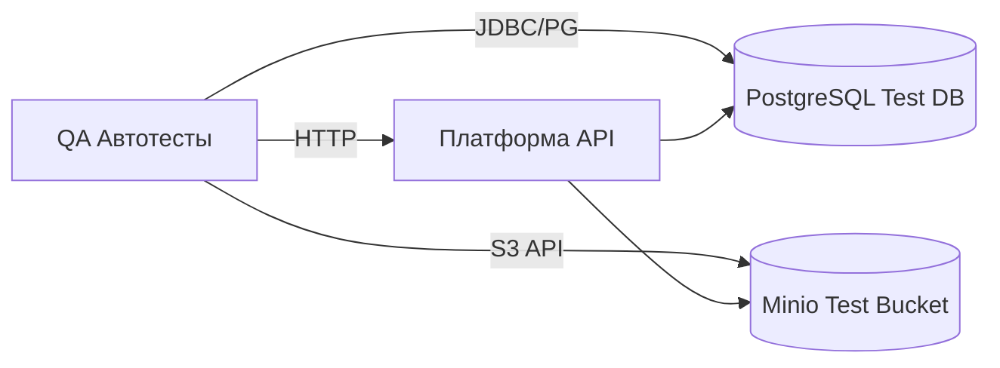

## Проект
- Цель: построение надежной тестовой инфраструктуры с акцентом на бизнес-критичные сценарии
- Архитектура: Платформа, API Docs, Бот, PostgreSQL, Minio (тестовые контуры)

---

## Тестовая стратегия
- Типы тестирования: Smoke, Sanity, Регресс, API, Интеграционное (DB/Minio/GLONASS), Нагрузочное (для критичных путей), UI/E2E, Unit, Безопасность (OWASP Top 10)
- Приоритет: бизнес-критичные пользовательские пути, авторизация, ключевые CRUD, интеграции БД/Minio
- **Статус покрытия:** ✅ **100% эндпоинтов из OpenAPI схемы** (105/105 методов) + 4 не задокументированных

---

## Архитектура тестового стенда

## Политика работы с тестовыми данными
- Разделение окружений: dev/staging/pre-prod
- Хранение кредов в .env/секретах CI
- Приоритет чтения переменных: корневой `.env`
- Очистка тестовых данных после прогонов
- Ротация паролей и ключей, маскирование в логах

