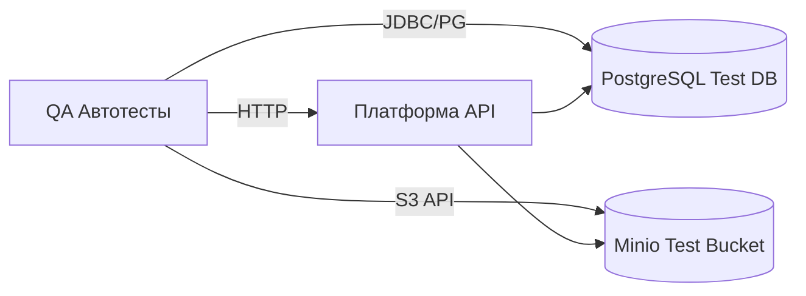

## Проект
- Цель: построение надежной тестовой инфраструктуры с акцентом на бизнес-критичные сценарии
- Архитектура: Платформа, API Docs, Бот, PostgreSQL, Minio (тестовые контуры)


---

## Тестовая стратегия
- Типы тестирования: Smoke, Sanity, Регресс, API, Интеграционное (DB/Minio), Нагрузочное (для критичных путей), Безопасность (OWASP Top 10)
- Приоритет: бизнес-критичные пользовательские пути, авторизация, ключевые CRUD, интеграции БД/Minio

---

## Архитектура тестового стенда


## Политика работы с тестовыми данными
- Разделение окружений: dev/staging/pre-prod
- Хранение кредов в .env/секретах CI
- Приоритет чтения переменных: корневой `.env`
- Очистка тестовых данных после прогонов
- Ротация паролей и ключей, маскирование в логах

---

## QA Статус

- Покрытие автотестами: ~20% (Auth, User, Vehicle — Smoke)
- Тесты: 23 теста, 13 уникальных эндпоинтов, все passed
- Ключевые изменения: User/Vehicle приведены к OpenAPI схемам, тесты совместимы с .env в корне, все зависимости установлены
## Баг-репорт
- Баги: 

```#BUG-USER-PHONE-VALIDATION` — Регистрация с телефоном, содержащим буквы, проходит (201), ожидалась валидационная ошибка 422/400. Требуется корректная валидация phone.```

```#BUG-USER-EMAIL-VALIDATION` — Регистрация с невалидным email (`not-an-email`) проходит (201), ожидалась 422/400. Требуется корректная валидация email.```

