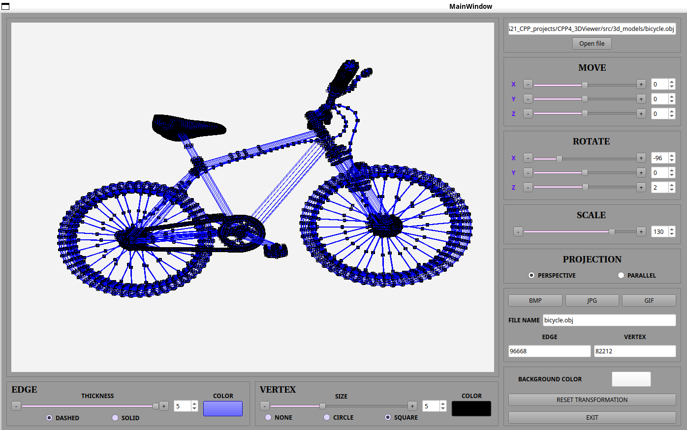

# 3DViewer v2.0

## Описание

В данном групповом учебном проекте реализовано приложение 3DViewer v2.0 для просмотра 3D-моделей в каркасном виде на языке программирования С++ в парадигме объектно-ориентированного программирования.

Реализован паттерн MVC (разделена логика(/logic), представление(/viewer), контроллер(/controller)), а также релизованы:

- Порождающий паттерн **Одиночка (singleton)**;  
- Структурный паттерн **Фасад (facade)**;  
- Поведенческий паттерн **Стратегия (strategy)**;  
- Поведенческий паттерн **Наблюдатель (observer)**.

- Программа разработана на языке C++ стандарта C++17.
- При написании кода соблюден Google Style.
- Сборка программы настроена с помощью Makefile со стандартным набором целей для GNU-программ: all, install, uninstall, clean, dvi, dist, tests. 
- Обеспечено полное покрытие unit-тестами модулей, связанных с загрузкой моделей и аффинными преобразованиями.
- В один момент времени только одна модель на экране.
- Программа предоставляет возможность:
    - Загружать каркасную модель из файла формата obj (поддержка только списка вершин и поверхностей);
    - Перемещать модель на заданное расстояние относительно осей X, Y, Z;
    - Поворачивать модель на заданный угол относительно своих осей X, Y, Z;
    - Масштабировать модель на заданное значение.
- В программе реализован графический пользовательский интерфейс, на базе  GUI-библиотеки с API для C++ Qt.
- Графический пользовательский интерфейс содержит:
    - Кнопку для выбора файла с моделью и поле для вывода его названия;
    - Зону визуализации каркасной модели;
    - Кнопку/кнопки и поля ввода для перемещения модели;
    - Кнопку/кнопки и поля ввода для поворота модели;
    - Кнопку/кнопки и поля ввода для масштабирования модели; 
    - Информацию о загруженной модели — название файла, кол-во вершин и ребер.
- Программа корректно обрабатывает и позволять пользователю просматривать модели с деталями до 100, 1000, 10 000, 100 000, 1 000 000 вершин без зависания.
- Программа позволяет настраивать тип проекции (параллельная и центральная).
- Программа позволяет настраивать тип (сплошная, пунктирная), цвет и толщину ребер, способ отображения (отсутствует, круг, квадрат), цвет и размер вершин.
- Программа позволяет выбирать цвет фона.
- Настройки сохраняются между перезапусками программы.
- Программа позволяет сохранять полученные («отрендеренные») изображения в файл в форматах bmp и jpeg.
- Программа позволяет по специальной кнопке записывать небольшие «скринкасты» — текущие пользовательские аффинные преобразования загруженного объекта в gif-анимацию (640x480, 10fps, 5s).

Авторы проекта: directpi (backend), janeenga(interface).