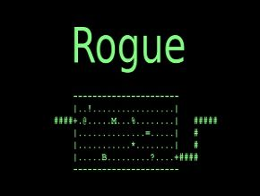

[К оглавлению](../../README.md)

# Project Team

В этом командном проекте разработано консольное игровое «rogue-like» приложение на языке программирования Java с использованием библиотеки curses (в версии JCurses для Java) в духе классической игры Rogue 1980 года разработки.

## Содержание  
[Общая информация](#общая-информация)  
[Архитектура приложения](#архитектура-приложения)  
[Сущности игры](#сущности-игры)  
[Логика игры](#логика-игры)  
[Логика персонажа](#логика-персонажа)  
[Логика противников](#логика-противников)  
[Логика окружения](#логика-окружения)  
[Логика боя](#логика-боя)  
[Статистика](#статистика)  
[Авторы](#авторы)  

## Общая информация

### Архитектура приложения

Игровое приложение:
 - реализовано на языке Java версии 21;
 - имеет консольный интерфейс на базе библиотеки JCurses;
 - управлется с клавиатуры;
 - имеет архитектуру с четким разделением на слои (MVC):
    - model (Слой бизнес-логики);
    - view (Слой представления);
    - controller (Слой для взаимодействия);
    - datalayer (Слой доступа к данным прошлых игр).
 - реализована логика классической игры Rogue 1980 года с рядом упрощений.

## Сущности игры

Основные сущности:
- Игровая сессия;
- Уровень;
- Комната;
- Коридор;
- Персонаж;
- Рюкзак;
- Противник;
- Предмет.

### Логика игры
- Игра содержит 21 уровень с подземельями.
- Каждый уровень подземелья состоит из 9 комнат, соединенных коридорами.
- В каждой комнате могут находиться противники и предметы.
- Игрок управляет перемещением персонажа, взаимодействует с предметами и сражается с противниками.
- Цель игрока — найти на каждом уровне переход на следующий уровень и таким образом пройти 21 уровень.
- На каждом уровне игрок начинает в случайной позиции стартовой комнаты, где гарантированно отсутствуют противники.
- После смерти главного героя состояние игры сбрасывается и все возвращается к началу.
- С каждым новым уровнем повышается количество и сложность противников, снижается количество полезных предметов и повышается количество сокровищ.
- После любого прохождения (успешного и нет) результат игрока фиксируется в таблицу рекордов, где указывается достигнутый уровень подземелья и количество собранных сокровищ. Таблица рекордов сортируется по количеству сокровищ.
- Вся игра работает в пошаговом режиме (каждое действие игрока запускает действия противников).

### Логика персонажа
- Характеристика здоровья персонажа показывает его текущий уровень здоровья, и когда здоровье персонажа достигает 0, игра заканчивается.
- Характеристика максимального уровня здоровья показывает максимальный уровень здоровья персонажа, который может быть восстановлен путем употребления еды.
- Характеристика ловкости участвовует в формуле вычисления вероятности попадания противников по персонажу и персонажа по противникам.
- Характеристика силы определяет базовый урон, наносимый персонажем без оружия, а также участвовать в формуле вычисления урона при использовании оружия.
- За победу над противником персонаж получает количество сокровищ, зависящее от сложности противника.
- Персонаж может поднимать предметы и складывать в свой рюкзак, а затем использовать их.
- Каждый предмет при использовании может временно или постоянно изменять одну из характеристик персонажа.
- При достижении выхода из уровня персонаж автоматически попадает на следующий уровень.

### Логика противников
- Каждый противник имеет аналогичные игроку характеристики здоровья, ловкости, скорости и силы, дополнительно к этому имеет характеристику враждебности.
- Характеристика враждебности определяет расстояние, с которого противник начинает преследовать игрока.
- 6 видов противников: 
  + Зомби (отображение: зеленый z). 
  + Вампир (отображение: красная v). 
  + Привидение (отображение: белый g). 
  + Огр (отображение: желтый O).
  + Змей-маг (отображение: белая s).
  + Мимик (отображение: белая m).
- Каждый тип противников имеет свой паттерн для передвижения по комнате.

### Логика окружения
- Типы предметов:
  + сокровища;
  + еда;
  + эликсиры;
  + свитки;
  + оружие.
- Когда персонаж наступает на предмет, он автоматически добавляется в рюкзак, если он неполон (в рюкзаке может храниться максимум 9 предметов каждого типа).
- Еда, эликсиры, свитки при использовании тратятся.
- Оружие при смене падает на пол, на соседнюю клетку.
- Каждый уровень подземелья имеет наполнение, зависящее от своего индекса: 
  + Чем глубже уровень, тем он сложнее;
  + Уровень состоит из комнат;
  + Комнаты соединены коридорами;
  + Комнаты содержат противников и предметы;
  + Противники и персонаж могут перемещаться по комнатам;
  + Каждый уровень имеет гарантированный переход на следующий уровень;
  + Выход из последнего уровня завершает игру.

### Логика боя
- Бой вычисляется в пошаговом режиме.
- Атака производится путем перемещения персонажа по направлению к противнику.
- Инициация боя происходит при контакте с врагом.
- Удары просчитываются по очереди, в несколько этапов: 
  + 1 этап расчета удара — проверка на попадание. Проверка на попадание случайна и высчитывается из ловкости и скорости бьющего и цели удара;
  + 2 этап — расчет урона. Рассчитывается из силы и модификаторов (оружия);
  + 3 этап — применение урона. Урон вычитается из здоровья. Если здоровье падает до 0 или ниже, то противник или персонаж погибает;
- Из каждого противника при победе выпадает случайное количество сокровищ, зависящее от враждебности, силы, ловкости и здоровья противника.

### Управление
- Управление персонажем:
  + Передвижение при помощи клавиш WASD.
  + Применение оружия из рюкзака при помощи кнопки h.
  + Применение аптечки из рюкзака при помощи кнопки j.
  + Применение эликсира из рюкзака при помощи кнопки k.
  + применение свитка из рюкзака при помощи e.
- Любое использование чего-либо из рюкзака приводит к печати списка предметов этого типа на экран с вопросом игроку, что нужно выбрать (1-9).

### Статистика
- В игре собирается и отображается в отдельном представлении статистика всех прохождений, отсортированная по количеству набранных сокровищ: количество сокровищ, достигнутый уровень, количество побежденных противников, количество съеденной еды, количество выпитых эликсиров, количество прочитанных свитков, количество нанесенных и пропущенных ударов, количество пройденных клеток.
- После прохождения каждого уровня сохраняется полученная статистика и номер пройденного уровня.

### Авторы

+ margarin
+ directpi
+ minnaepi

[В начало](#project-team)